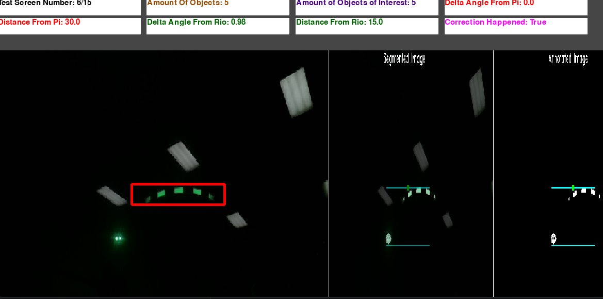

Finished Development: 02/27/2022

Java Code Location (on my team's robotics GitHub): https://github.com/Team2122/2122_TeamTators/blob/master/2022%20Off-Season%20Code/Core%20Robot/robot/subsystems/Vision.java

# Summary
This was a GUI application that helped test the robot code through simulation. For robotics that year I wrote a vision
validation checker. We ran image processing code that would pick up the target that the robot shot at. It "saw" the target
because there was retro-reflective tape all around the target. Using the image processing, the software would know
how far away the robot was from the target and where it had to aim to shoot at the target. It did this by drawing a 
bounding box around all the retro-reflective objects and using some equations, the center of the box would give the 
distance from the target and where the robot had to aim. The image processing software was run on a raspberry pi 
and limelight. This meant that the entire shooting process could be automated (and mostly was automated). There was one
issue, however, other robot's lights would fool the image processing code into thinking that the robot light was a 
retro-reflective project. That is where my code came in. My code would get all the retro-reflective objects from the
image processing code. Then it would remove any extraneous objects that were not a part of the target. It did this by
choosing the plane (object's with x and y coordinates that are close to each other) with the most objects on it. This worked because the retro-reflective objects around the target were
all close to the same y coordinate. Therefore, if an object did not was not similar to any other object on a plane it would
create a new plane. While choosing the correct plane was not guaranteed, it was very unlikely that the wrong plane would be chosen.
Most of the extraneous retro-reflective objects were caused by a robot light, so there would be a plane of one.
IMPORTANT NOTE: This is only a 'simulation' of what the actual data would look like. I had the originally images, but did 
not have the original data. The 'simulation' is accurate and this is what the application actually looked like with the 
original data.

# Example Images
Below will be some images. The leftmost image is the bounding box this software produced of the retro-reflective objects.
The two other images are where the rasberry pi software thought the bounding box was.

## This image shows where the rasberry pi software was wrong and this software correcting the issue

## This image shows where the rasberry pi software was right, so the software did not change anything

# How to Run
- install 'pygame' by running 'pip install pygame' in the terminal
- run the 'main.py' file from the root directory of this project
- use the arrow keys to go between keys (left and right arrow keys)
- press the 'h' key to switch between viewing all screens and only the screens where this software corrected the rasberry pi software